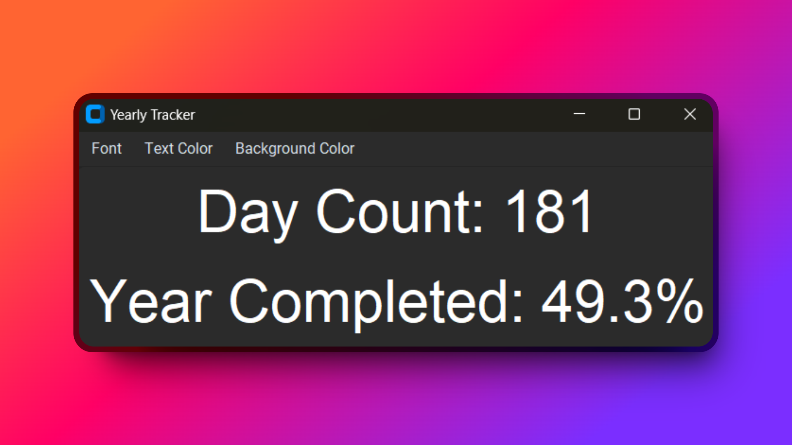

# TrackYear V2 📅

Introducing our innovative app that helps you track the progress of the year by displaying the percentage completed and the current day count, with the added bonus of customizable options to make your experience unique and personalized. Made with Python, our app is reliable and user-friendly, allowing you to stay on top of your goals and accomplishments with ease.

Download Now: Files Attached to Repository

## How to use

Run the python file using Command Prompt or Windows PowerShell
`python "path-of-file"`
or 
`python3 "path-of-file"`

## Screenshots

## Acknowledgements

 - [Youtube Channel](https://www.youtube.com/@SarthakChoyal?sub_confirmation=1)
 - Created by Sarthak Choyal
 - If there are any issues join our [Discord Server](https://discord.gg/GAJe275wBH)
 - Made using the [Customtkinter library](https://github.com/TomSchimansky/CustomTkinter)
 - Made with Python 3.12.4
## Optimizations

- Currently only supports Windows 10/11

